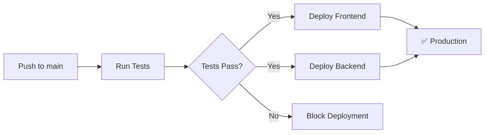

# 🚀 AURA Deployment Guide

Complete guide to deploy AURA to production using Vercel (frontend) and Railway (backend + PostgreSQL).

## 📋 Prerequisites

- GitHub account with this repository
- Vercel account (free tier)
- Railway account (with $5 credit/month)

---

## 🎯 Deployment Stack

| Component | Service | Cost | URL |
|-----------|---------|------|-----|
| Frontend | Vercel | **Free** | `your-app.vercel.app` |
| Backend API | Railway | **$5/month credit** | `your-app.up.railway.app` |
| PostgreSQL | Railway | **Included** | Internal Railway network |

---

## 1️⃣ Deploy Backend to Railway

### Step 1: Create Railway Account

1. Go to [railway.app](https://railway.app)
2. Sign up with GitHub
3. You'll get **$5 in credits per month**

### Step 2: Create New Project - EMPTY Project First

**IMPORTANTE:** Vamos a crear el proyecto vacío primero, luego configurarlo.

1. Click **"New Project"**
2. **NO selecciones "Deploy from GitHub repo" todavía**
3. En su lugar, selecciona **"Empty Project"** (o solo cierra el diálogo)
4. Ahora tienes un proyecto vacío llamado algo como "project-abc123"

### Step 3: Add PostgreSQL Database FIRST

**Antes de agregar el backend, agregamos la base de datos:**

1. Dentro de tu proyecto vacío, verás un botón **"+ New"** (arriba a la derecha)
2. Click **"+ New"**
3. Selecciona **"Database"**
4. Selecciona **"Add PostgreSQL"**
5. Railway creará un servicio de PostgreSQL
6. Espera ~30 segundos a que se inicie (verás un indicador verde cuando esté listo)

**Ahora deberías ver un servicio "Postgres" en tu proyecto.**

### Step 4: Add Backend Service

**Ahora sí agregamos el código del backend:**

1. Click **"+ New"** de nuevo
2. Esta vez selecciona **"GitHub Repo"**
3. Si es tu primera vez:
   - Click **"Configure GitHub App"**
   - Autoriza Railway a acceder a tus repos
   - Selecciona el repositorio **`aura_test`**
4. Railway te mostrará el repositorio
5. **IMPORTANTE:** Click en **"Add variables"** o **"Deploy"** (Railway detectará que es un monorepo)

### Step 5: Configure Root Directory (CRÍTICO)

**Railway necesita saber que el backend está en una subcarpeta:**

1. En el servicio del backend que acabas de crear, click en él para abrirlo
2. Ve a la pestaña **"Settings"** (⚙️ icono arriba)
3. Busca la sección **"Build"** o **"Service"**
4. Encuentra **"Root Directory"** o **"Source"**
5. Cambia el valor de `/` a: **`backend`**
6. Click **"Save"** o los cambios se guardan automáticamente

**Esto le dice a Railway que el código está en la carpeta `backend/`**

### Step 6: Configure Build & Start Commands

**Ahora configuramos cómo Railway debe construir y ejecutar tu app:**

Aún en **Settings**, busca estas secciones:

**Build Command:**
1. Busca **"Build Command"** (puede estar en la sección "Build")
2. Puede estar vacío o tener algo como `npm install`
3. Cámbialo a: `npm ci && npm run build`
4. Esto instalará dependencias y compilará TypeScript

**Start Command:**
1. Busca **"Start Command"** (puede estar en la sección "Deploy")
2. Puede estar vacío o tener algo como `npm start`
3. Asegúrate que diga: `npm start`
4. Esto ejecutará el backend compilado

**Install Command (opcional):**
- Si ves "Install Command", déjalo en `npm install` o vacío (Railway lo hace automáticamente)

### Step 7: Configure Environment Variables

**Ahora configuramos las variables de entorno:**

1. Aún en el servicio backend, ve a la pestaña **"Variables"** (📝 icono arriba)
2. Verás una lista vacía o con algunas variables auto-generadas
3. Click **"+ New Variable"** o **"Raw Editor"** para agregar múltiples a la vez

**Si usas Raw Editor, pega esto:**

```env
PORT=3000
NODE_ENV=production
DB_HOST=${{Postgres.PGHOST}}
DB_PORT=${{Postgres.PGPORT}}
DB_USERNAME=${{Postgres.PGUSER}}
DB_PASSWORD=${{Postgres.PGPASSWORD}}
DB_NAME=${{Postgres.PGDATABASE}}
JWT_SECRET=CAMBIA_ESTO_POR_UN_SECRET_SEGURO_GENERADO
JWT_EXPIRES_IN=7d
```

**Si agregas una por una, crea estas variables:**

| Variable | Valor |
|----------|-------|
| `PORT` | `3000` |
| `NODE_ENV` | `production` |
| `DB_HOST` | `${{Postgres.PGHOST}}` |
| `DB_PORT` | `${{Postgres.PGPORT}}` |
| `DB_USERNAME` | `${{Postgres.PGUSER}}` |
| `DB_PASSWORD` | `${{Postgres.PGPASSWORD}}` |
| `DB_NAME` | `${{Postgres.PGDATABASE}}` |
| `JWT_SECRET` | (genera uno seguro - ver abajo) |
| `JWT_EXPIRES_IN` | `7d` |

**Para JWT_SECRET, genera uno así:**
```bash
# En terminal/PowerShell:
node -e "console.log(require('crypto').randomBytes(32).toString('hex'))"
```

**NOTA:** Las variables `${{Postgres.XXX}}` son referencias al servicio PostgreSQL que creamos. Railway las resolverá automáticamente.

### Step 8: Configure Health Check

**Railway puede verificar que tu app esté funcionando:**

1. En **Settings** del servicio backend
2. Busca la sección **"Health Check"** o **"Healthcheck"**
3. Si no existe, es opcional (Railway igual funcionará)
4. Si existe, configura:
   - **Health Check Path:** `/health`
   - **Timeout:** `10` seconds
   - **Interval:** `30` seconds

### Step 9: Deploy!

**Ahora sí, ¡a hacer deploy!:**

1. **OPCIÓN A:** Click el botón **"Deploy"** (si lo ves arriba a la derecha)
2. **OPCIÓN B:** Ve a la pestaña **"Deployments"** y click **"Deploy"**
3. **OPCIÓN C:** Railway puede auto-deployar si ya guardaste todo

**Verás logs en tiempo real:**
- Instalando dependencias...
- Building...
- Starting...
- ✅ Success!

**El deploy toma ~2-4 minutos la primera vez.**

### Step 10: Verificar Deployment

**Cuando termine, verifica que funcionó:**

1. Ve a **Settings** → **Networking** o **Domains**
2. Verás algo como: `backend-production-abc123.up.railway.app`
3. Click en el link o cópialo
4. Agrégale `/health` al final: `https://tu-url.up.railway.app/health`
5. Deberías ver:
   ```json
   {
     "status": "ok",
     "message": "AURA API is running",
     "timestamp": "2024-..."
   }
   ```

### Step 11: Guardar Backend URL

**MUY IMPORTANTE - Guarda esta URL:**

```
https://tu-backend-production-xyz.up.railway.app
```

**La necesitarás para configurar Vercel en el siguiente paso!**

---

## 2️⃣ Deploy Frontend to Vercel

### Step 1: Create Vercel Account

1. Abre [vercel.com](https://vercel.com)
2. Click **"Sign Up"** (arriba a la derecha)
3. Selecciona **"Continue with GitHub"**
4. Autoriza Vercel a acceder a tu cuenta de GitHub
5. Completa tu perfil si te lo pide

**Ahora estás en el dashboard de Vercel.**

### Step 2: Import Project from GitHub

1. En el dashboard, busca el botón **"Add New..."** (arriba a la derecha)
2. Click **"Add New..."** → **"Project"**
3. Verás una lista de tus repositorios de GitHub
4. **Si no ves `aura_test`:**
   - Click **"Adjust GitHub App Permissions"** o **"Configure GitHub App"**
   - Selecciona tu usuario/organización
   - Da acceso al repositorio `aura_test`
   - Regresa a Vercel
5. Ahora deberías ver **`aura_test`** en la lista
6. Click el botón **"Import"** al lado de `aura_test`

### Step 3: Configure Project Settings

**Vercel te mostrará una pantalla de configuración. Aquí es CRÍTICO configurar bien:**

**📁 Root Directory (MUY IMPORTANTE):**
1. Verás un campo **"Root Directory"** con un botón **"Edit"**
2. Click **"Edit"**
3. Se abrirá un explorador de carpetas
4. Selecciona **`frontend`** (la carpeta, no el archivo)
5. Click **"Continue"** o ✓

**🔧 Framework Preset:**
- Vercel debería auto-detectar **"Vite"**
- Si no, selecciona **"Vite"** del dropdown

**⚙️ Build and Output Settings:**

Vercel usualmente los detecta automáticamente, pero verifica:

- **Build Command:** `npm run build` ✅ (debe estar así)
- **Output Directory:** `dist` ✅ (debe estar así)
- **Install Command:** `npm install` ✅ (puede estar vacío, está bien)

**Si están correctos, NO los cambies. Si están vacíos o incorrectos:**

1. Click **"Override"** en cada sección
2. Ingresa los valores correctos:
   - Build Command: `npm run build`
   - Output Directory: `dist`

### Step 4: Add Environment Variables

**CRÍTICO - Aquí conectamos el frontend con el backend de Railway:**

1. En la misma pantalla de configuración, busca la sección **"Environment Variables"**
2. Verás campos para agregar variables
3. Agrega esta variable:

| Name (Nombre) | Value (Valor) |
|---------------|---------------|
| `VITE_API_BASE_URL` | `https://tu-backend-railway.up.railway.app` |

**⚠️ IMPORTANTE:**
- Usa la URL que guardaste del Step 11 de Railway
- **SIN** `/health` al final
- **SIN** barra diagonal `/` al final
- Ejemplo correcto: `https://backend-production-abc123.up.railway.app`

**Para agregar la variable:**
- Escribe `VITE_API_BASE_URL` en el campo "Key" o "Name"
- Pega tu URL de Railway en el campo "Value"
- Click el botón **"Add"** (si hay)

### Step 5: Deploy!

**Ahora sí, desplegamos:**

1. Revisa que todo esté correcto:
   - ✅ Root Directory: `frontend`
   - ✅ Framework: Vite
   - ✅ Environment Variable: `VITE_API_BASE_URL` con tu URL de Railway
2. Click el botón grande **"Deploy"** (abajo)
3. Vercel comenzará el deployment

**Verás una pantalla con logs en vivo:**
- Building... (instalando dependencias)
- Compiling... (construyendo el proyecto)
- ✅ Success! (o similar)

**El primer deploy toma ~1-3 minutos.**

### Step 6: Ver tu App Desplegada

**Cuando termine, verás una pantalla de celebración 🎉:**

1. Vercel te mostrará tu URL: `https://aura-test-xxxxx.vercel.app`
2. Click el botón **"Visit"** o en la imagen de preview
3. ¡Tu frontend debería estar en vivo!

**Si ves la página pero no puedes hacer login/register:**
- Es normal, falta un paso más (configurar CORS en Railway)
- Continúa al siguiente paso

### Step 7: Copiar URL de Vercel

**Guarda tu URL de Vercel para el siguiente paso:**

```
https://aura-test-xxxxx.vercel.app
```

**Donde encontrarla:**
- En la pantalla de celebración después del deploy
- O ve a tu proyecto → **"Deployments"** → Click en el último → Copia la URL
- O en **"Settings"** → **"Domains"**

### Step 8: Configurar Custom Domain (Opcional)

**Si tienes un dominio propio:**

1. Ve a **"Settings"** → **"Domains"**
2. Click **"Add"**
3. Escribe tu dominio: `tuapp.com`
4. Vercel te dará instrucciones de DNS
5. Agrega los registros en tu proveedor de dominio
6. Espera ~10 minutos a que se propague

---

## 3️⃣ Configure GitHub Actions (Automatic Deployments)

### Step 1: Get Vercel Tokens

1. Go to [vercel.com/account/tokens](https://vercel.com/account/tokens)
2. Create a new token: **"GitHub Actions Deploy Token"**
3. **Copy the token** (you won't see it again!)

4. Install Vercel CLI locally:
   ```bash
   npm i -g vercel
   ```

5. Link your project:
   ```bash
   cd frontend
   vercel link
   ```

6. Get your Vercel credentials:
   ```bash
   cat .vercel/project.json
   ```
   
   Copy the `projectId` and `orgId`

### Step 2: Get Railway Token

1. Go to [railway.app/account/tokens](https://railway.app/account/tokens)
2. Create a new token: **"GitHub Actions Deploy"**
3. **Copy the token**

### Step 3: Add GitHub Secrets

Go to your GitHub repository → **Settings** → **Secrets and variables** → **Actions**

Add these secrets:

| Secret Name | Value | Where to get it |
|-------------|-------|----------------|
| `VERCEL_TOKEN` | `your_vercel_token` | Vercel account tokens |
| `VERCEL_ORG_ID` | `team_xxx` or `user_xxx` | `.vercel/project.json` |
| `VERCEL_PROJECT_ID` | `prj_xxx` | `.vercel/project.json` |
| `RAILWAY_TOKEN` | `your_railway_token` | Railway account tokens |

### Step 4: Test Automatic Deployment

1. Make a small change to your code
2. Commit and push to `main`:
   ```bash
   git add .
   git commit -m "test: trigger automatic deployment"
   git push origin main
   ```

3. Go to **Actions** tab in GitHub
4. Watch your deployment workflow run!

**Workflow will:**
- ✅ Run tests
- ✅ Deploy frontend to Vercel
- ✅ Deploy backend to Railway
- ✅ Report status

---

## 4️⃣ Update CORS in Backend (CRÍTICO)

**Por qué necesitas esto:**
- Tu frontend en Vercel necesita permiso para hacer requests al backend en Railway
- Sin CORS configurado, el navegador bloqueará las peticiones

### Opción 1: Configurar por Variable de Entorno (RECOMENDADO)

**Es la forma más fácil, sin tocar código:**

1. Ve a Railway → tu proyecto → servicio **backend**
2. Ve a la pestaña **"Variables"**
3. Click **"+ New Variable"**
4. Agrega:
   - **Name:** `CORS_ORIGIN`
   - **Value:** `https://tu-app.vercel.app` (tu URL real de Vercel)
5. Click **"Add"** o guardar
6. Railway re-desplegará automáticamente (~2 mins)

**Ejemplo:**
```env
CORS_ORIGIN=https://aura-test-abc123.vercel.app
```

### Opción 2: Actualizar el Código

**Si prefieres tener más control:**

1. Abre `backend/src/index.ts` en tu editor
2. Busca la línea `app.use(cors());`
3. Reemplázala por:

```typescript
app.use(cors({
  origin: process.env.CORS_ORIGIN || 'http://localhost:5173',
  credentials: true,
}));
```

4. Guarda el archivo
5. Sube los cambios:

```bash
git add backend/src/index.ts
git commit -m "feat(backend): configure CORS for production"
git push origin main
```

6. Railway auto-desplegará (~2-3 mins)
7. Luego agrega la variable `CORS_ORIGIN` en Railway como en Opción 1

### Verificar que CORS está configurado

1. Abre tu app en Vercel
2. Abre DevTools (F12) → pestaña **"Console"**
3. Intenta hacer login/register
4. **✅ Si no hay errores de CORS:** ¡Funcionó!
5. **❌ Si ves "CORS error":** Verifica que la URL sea exacta (sin `/` al final)

---

## 5️⃣ Verify Deployment

### Test 1: Backend Health Check

**En tu navegador:**
1. Ve a: `https://tu-backend-railway.up.railway.app/health`
2. Deberías ver:
```json
{
  "status": "ok",
  "message": "AURA API is running",
  "timestamp": "2024-..."
}
```

**✅ OK:** Backend funcionando | **❌ Error:** Revisa logs en Railway

### Test 2: Frontend Carga

1. Ve a: `https://tu-app.vercel.app`
2. Deberías ver la página de Login/Register
3. **✅ OK:** Frontend desplegado | **❌ 404:** Revisa Root Directory en Vercel

### Test 3: Registro (CRÍTICO - prueba la integración completa)

1. En tu app, ve a **Register**
2. Llena: email: `test@example.com`, nombre: `Test`, apellido: `User`, password: `test123`
3. Click **Register**
4. Abre DevTools (F12) → **Network** para ver requests

**✅ ÉXITO:** Redirige a Dashboard, ves tu perfil
**❌ ERROR:** Revisa tabla abajo

| Síntoma | Solución |
|---------|----------|
| "Network Error" | CORS mal configurado (Step 4) |
| "Failed to fetch" | Backend caído (logs Railway) |
| Nada pasa | `VITE_API_BASE_URL` incorrecta en Vercel |

### Test 4: Login

1. Abre incógnito o cierra sesión
2. Login con: `test@example.com` / `test123`
3. **✅ Deberías:** Ver Dashboard

### Test 5: Update Profile

1. En Dashboard, edita tu nombre
2. Click **Update**
3. **✅ Deberías:** Ver cambios guardados

### Test 6: Lista de Usuarios

1. En Dashboard, sección **All Users**
2. **✅ Deberías:** Ver tu usuario en la lista

---

## 📊 Monitoring & Logs

### Railway

- **Logs:** Railway Dashboard → Your Service → **Logs** tab
- **Metrics:** CPU, Memory, Network usage
- **Database:** Query logs, connection pool stats

### Vercel

- **Deployment Logs:** Vercel Dashboard → Your Project → **Deployments**
- **Function Logs:** (if using serverless functions)
- **Analytics:** Free analytics on all deployments

---

## 🔄 CI/CD Workflow

Every push to `main` branch:



---

## 🐛 Troubleshooting

### Backend Issues

**Problem:** Backend not starting

**Solution:** Check Railway logs:
1. Railway Dashboard → Service → Logs
2. Look for errors in build or start command
3. Verify environment variables are set

**Problem:** Database connection failed

**Solution:**
1. Verify PostgreSQL service is running
2. Check if `synchronize: true` is disabled in production
3. Railway auto-provides database URLs, ensure they're referenced correctly

**Problem:** Health check failing

**Solution:**
1. Test health endpoint manually: `/health`
2. Increase health check timeout in Railway settings
3. Check if server is binding to `0.0.0.0` not just `localhost`

### Frontend Issues

**Problem:** API calls failing (CORS errors)

**Solution:**
1. Update `VITE_API_BASE_URL` in Vercel
2. Ensure Railway backend URL is correct
3. Configure CORS in backend to allow Vercel domain

**Problem:** Environment variable not working

**Solution:**
1. Vercel requires `VITE_` prefix for client-side variables
2. Redeploy after adding/changing variables
3. Check variable in Vercel Dashboard → Settings → Environment Variables

### GitHub Actions Issues

**Problem:** Deployment workflow failing

**Solution:**
1. Check **Actions** tab for error logs
2. Verify all GitHub secrets are set correctly
3. Ensure token permissions are correct

---

## 💰 Cost Breakdown

| Service | Free Tier | Estimated Cost |
|---------|-----------|----------------|
| Vercel | ✅ Unlimited | **$0/month** |
| Railway | $5 credit/month | **~$3-4/month** (with credit = ~$1-2 paid) |
| **Total** | | **~$1-2/month** |

**Notes:**
- Railway $5 credit renews monthly
- This project should stay under $5/month
- First month is effectively free

---

## 🎉 Success!

Your AURA app is now live:

- **Frontend:** `https://your-app.vercel.app`
- **Backend API:** `https://your-backend.up.railway.app`
- **Auto-Deploy:** Every push to `main`
- **Tests:** Run before every deployment

---

## 📚 Additional Resources

- [Vercel Documentation](https://vercel.com/docs)
- [Railway Documentation](https://docs.railway.app)
- [GitHub Actions Documentation](https://docs.github.com/en/actions)

---

## 🔐 Security Checklist

After deployment:

- [ ] Change `JWT_SECRET` to a strong random string
- [ ] Disable `synchronize: true` in TypeORM (use migrations)
- [ ] Configure CORS with specific frontend domain
- [ ] Enable HTTPS only (Vercel and Railway do this automatically)
- [ ] Set up environment-specific variables
- [ ] Review Railway database backups settings
- [ ] Set up error monitoring (optional: Sentry)
- [ ] Configure rate limiting (future improvement)

---

## 📝 Next Steps

1. **Custom Domain:** Add your own domain in Vercel
2. **Monitoring:** Set up Sentry or LogRocket
3. **Backups:** Configure Railway database backups
4. **Performance:** Enable caching, CDN optimization
5. **Security:** Add rate limiting, implement refresh tokens

---

**Need Help?**

- Railway Discord: [discord.gg/railway](https://discord.gg/railway)
- Vercel Support: [vercel.com/support](https://vercel.com/support)

