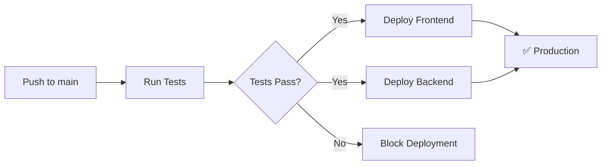

# 🚀 AURA Deployment Guide

Complete guide to deploy AURA to production using Vercel (frontend) and Railway (backend + PostgreSQL).

## 📋 Prerequisites

- GitHub account with this repository
- Vercel account (free tier)
- Railway account (with $5 credit/month)

---

## 🎯 Deployment Stack

| Component | Service | Cost | URL |
|-----------|---------|------|-----|
| Frontend | Vercel | **Free** | `your-app.vercel.app` |
| Backend API | Railway | **$5/month credit** | `your-app.up.railway.app` |
| PostgreSQL | Railway | **Included** | Internal Railway network |

---

## 1️⃣ Deploy Backend to Railway

### Step 1: Create Railway Account

1. Go to [railway.app](https://railway.app)
2. Sign up with GitHub
3. You'll get **$5 in credits per month**

### Step 2: Create Empty Project First

**IMPORTANT:** We'll create an empty project first, then configure it.

1. Click **"New Project"**
2. **DO NOT select "Deploy from GitHub repo" yet**
3. Instead, select **"Empty Project"** (or just close the dialog)
4. You now have an empty project named something like "project-abc123"

### Step 3: Add PostgreSQL Database FIRST

**Before adding the backend, we add the database:**

1. Inside your empty project, you'll see a **"+ New"** button (top right)
2. Click **"+ New"**
3. Select **"Database"**
4. Select **"Add PostgreSQL"**
5. Railway will create a PostgreSQL service
6. Wait ~30 seconds for it to start (you'll see a green indicator when ready)

**You should now see a "Postgres" service in your project.**

### Step 4: Add Backend Service

**Now we add the backend code:**

1. Click **"+ New"** again
2. This time select **"GitHub Repo"**
3. If it's your first time:
   - Click **"Configure GitHub App"**
   - Authorize Railway to access your repos
   - Select the **`aura_test`** repository
4. Railway will show you the repository
5. **IMPORTANT:** Click **"Add variables"** or **"Deploy"** (Railway will detect it's a monorepo)

### Step 5: Configure Root Directory (CRITICAL)

**Railway needs to know the backend is in a subfolder:**

1. Click on the backend service you just created to open it
2. Go to the **"Settings"** tab (⚙️ icon at the top)
3. Look for the **"Build"** or **"Service"** section
4. Find **"Root Directory"** or **"Source"**
5. Change the value from `/` to: **`backend`**
6. Click **"Save"** or changes save automatically

**This tells Railway the code is in the `backend/` folder**

### Step 6: Configure Build & Start Commands

**Now we configure how Railway should build and run your app:**

Still in **Settings**, look for these sections:

**Build Command:**
1. Look for **"Build Command"** (may be in the "Build" section)
2. It may be empty or have something like `npm install`
3. Change it to: `npm ci && npm run build`
4. This will install dependencies and compile TypeScript

**Start Command:**
1. Look for **"Start Command"** (may be in the "Deploy" section)
2. It may be empty or have something like `npm start`
3. Make sure it says: `npm start`
4. This will run the compiled backend

**Install Command (optional):**
- If you see "Install Command", leave it as `npm install` or empty (Railway does this automatically)

### Step 7: Configure Environment Variables

**Now we configure the environment variables:**

1. Still in the backend service, go to the **"Variables"** tab (📝 icon at top)
2. You'll see an empty list or some auto-generated variables
3. Click **"+ New Variable"** or **"Raw Editor"** to add multiple at once

**If using Raw Editor, paste this:**

```env
PORT=3000
NODE_ENV=production
DB_HOST=${{Postgres.PGHOST}}
DB_PORT=${{Postgres.PGPORT}}
DB_USERNAME=${{Postgres.PGUSER}}
DB_PASSWORD=${{Postgres.PGPASSWORD}}
DB_NAME=${{Postgres.PGDATABASE}}
JWT_SECRET=CHANGE_THIS_TO_A_SECURE_GENERATED_SECRET
JWT_EXPIRES_IN=7d
```

**If adding one by one, create these variables:**

| Variable | Value |
|----------|-------|
| `PORT` | `3000` |
| `NODE_ENV` | `production` |
| `DB_HOST` | `${{Postgres.PGHOST}}` |
| `DB_PORT` | `${{Postgres.PGPORT}}` |
| `DB_USERNAME` | `${{Postgres.PGUSER}}` |
| `DB_PASSWORD` | `${{Postgres.PGPASSWORD}}` |
| `DB_NAME` | `${{Postgres.PGDATABASE}}` |
| `JWT_SECRET` | (generate a secure one - see below) |
| `JWT_EXPIRES_IN` | `7d` |

**To generate JWT_SECRET:**
```bash
# In terminal/PowerShell:
node -e "console.log(require('crypto').randomBytes(32).toString('hex'))"
```

**NOTE:** The `${{Postgres.XXX}}` variables are references to the PostgreSQL service we created. Railway will resolve them automatically.

### Step 8: Configure Health Check

**Railway can verify your app is working:**

1. In backend service **Settings**
2. Look for **"Health Check"** or **"Healthcheck"** section
3. If it doesn't exist, it's optional (Railway will still work)
4. If it exists, configure:
   - **Health Check Path:** `/health`
   - **Timeout:** `10` seconds
   - **Interval:** `30` seconds

### Step 9: Deploy!

**Now let's deploy:**

1. **OPTION A:** Click the **"Deploy"** button (if you see it top right)
2. **OPTION B:** Go to **"Deployments"** tab and click **"Deploy"**
3. **OPTION C:** Railway may auto-deploy if you've saved everything

**You'll see real-time logs:**
- Installing dependencies...
- Building...
- Starting...
- ✅ Success!

**First deploy takes ~2-4 minutes.**

### Step 10: Verify Deployment

**When it finishes, verify it worked:**

1. Go to **Settings** → **Networking** or **Domains**
2. You'll see something like: `backend-production-abc123.up.railway.app`
3. Click the link or copy it
4. Add `/health` at the end: `https://your-url.up.railway.app/health`
5. You should see:
   ```json
   {
     "status": "ok",
     "message": "AURA API is running",
     "timestamp": "2024-..."
   }
   ```

### Step 11: Save Backend URL

**VERY IMPORTANT - Save this URL:**

```
https://your-backend-production-xyz.up.railway.app
```

**You'll need it to configure Vercel in the next step!**

---

## 2️⃣ Deploy Frontend to Vercel

### Step 1: Create Vercel Account

1. Go to [vercel.com](https://vercel.com)
2. Click **"Sign Up"** (top right)
3. Select **"Continue with GitHub"**
4. Authorize Vercel to access your GitHub account
5. Complete your profile if prompted

**You're now on the Vercel dashboard.**

### Step 2: Import Project from GitHub

1. In the dashboard, find the **"Add New..."** button (top right)
2. Click **"Add New..."** → **"Project"**
3. You'll see a list of your GitHub repositories
4. **If you don't see `aura_test`:**
   - Click **"Adjust GitHub App Permissions"** or **"Configure GitHub App"**
   - Select your user/organization
   - Grant access to the `aura_test` repository
   - Return to Vercel
5. You should now see **`aura_test`** in the list
6. Click the **"Import"** button next to `aura_test`

### Step 3: Configure Project Settings

**Vercel will show you a configuration screen. This is CRITICAL to configure correctly:**

**📁 Root Directory (VERY IMPORTANT):**
1. You'll see a **"Root Directory"** field with an **"Edit"** button
2. Click **"Edit"**
3. A folder explorer will open
4. Select **`frontend`** (the folder, not a file)
5. Click **"Continue"** or ✓

**🔧 Framework Preset:**
- Vercel should auto-detect **"Vite"**
- If not, select **"Vite"** from the dropdown

**⚙️ Build and Output Settings:**

Vercel usually detects these automatically, but verify:

- **Build Command:** `npm run build` ✅ (should be this)
- **Output Directory:** `dist` ✅ (should be this)
- **Install Command:** `npm install` ✅ (can be empty, that's fine)

**If they're correct, DON'T change them. If they're empty or incorrect:**

1. Click **"Override"** in each section
2. Enter the correct values:
   - Build Command: `npm run build`
   - Output Directory: `dist`

### Step 4: Add Environment Variables

**CRITICAL - This connects the frontend with the Railway backend:**

1. On the same configuration screen, find the **"Environment Variables"** section
2. You'll see fields to add variables
3. Add this variable:

| Name | Value |
|------|-------|
| `VITE_API_BASE_URL` | `https://your-backend-railway.up.railway.app` |

**⚠️ IMPORTANT:**
- Use the URL you saved from Railway Step 11
- **WITHOUT** `/health` at the end
- **WITHOUT** trailing slash `/`
- Correct example: `https://backend-production-abc123.up.railway.app`

**To add the variable:**
- Type `VITE_API_BASE_URL` in the "Key" or "Name" field
- Paste your Railway URL in the "Value" field
- Click the **"Add"** button (if present)

### Step 5: Deploy!

**Now let's deploy:**

1. Review that everything is correct:
   - ✅ Root Directory: `frontend`
   - ✅ Framework: Vite
   - ✅ Environment Variable: `VITE_API_BASE_URL` with your Railway URL
2. Click the big **"Deploy"** button (at bottom)
3. Vercel will start the deployment

**You'll see a screen with live logs:**
- Building... (installing dependencies)
- Compiling... (building the project)
- ✅ Success! (or similar)

**First deploy takes ~1-3 minutes.**

### Step 6: View Your Deployed App

**When it finishes, you'll see a celebration screen 🎉:**

1. Vercel will show your URL: `https://aura-test-xxxxx.vercel.app`
2. Click the **"Visit"** button or the preview image
3. Your frontend should be live!

**If you see the page but can't login/register:**
- This is normal, one more step is needed (configure CORS in Railway)
- Continue to the next step

### Step 7: Copy Vercel URL

**Save your Vercel URL for the next step:**

```
https://aura-test-xxxxx.vercel.app
```

**Where to find it:**
- On the celebration screen after deploy
- Or go to your project → **"Deployments"** → Click the latest → Copy the URL
- Or in **"Settings"** → **"Domains"**

### Step 8: Configure Custom Domain (Optional)

**If you have your own domain:**

1. Go to **"Settings"** → **"Domains"**
2. Click **"Add"**
3. Enter your domain: `yourapp.com`
4. Vercel will give you DNS instructions
5. Add the records in your domain provider
6. Wait ~10 minutes for propagation

---

## 3️⃣ Configure GitHub Actions (Automatic Deployments)

### Step 1: Get Vercel Tokens

1. Go to [vercel.com/account/tokens](https://vercel.com/account/tokens)
2. Create a new token: **"GitHub Actions Deploy Token"**
3. **Copy the token** (you won't see it again!)

4. Install Vercel CLI locally:
   ```bash
   npm i -g vercel
   ```

5. Link your project:
   ```bash
   cd frontend
   vercel link
   ```

6. Get your Vercel credentials:
   ```bash
   cat .vercel/project.json
   ```
   
   Copy the `projectId` and `orgId`

### Step 2: Get Railway Token

1. Go to [railway.app/account/tokens](https://railway.app/account/tokens)
2. Create a new token: **"GitHub Actions Deploy"**
3. **Copy the token**

### Step 3: Add GitHub Secrets

Go to your GitHub repository → **Settings** → **Secrets and variables** → **Actions**

Add these secrets:

| Secret Name | Value | Where to get it |
|-------------|-------|----------------|
| `VERCEL_TOKEN` | `your_vercel_token` | Vercel account tokens |
| `VERCEL_ORG_ID` | `team_xxx` or `user_xxx` | `.vercel/project.json` |
| `VERCEL_PROJECT_ID` | `prj_xxx` | `.vercel/project.json` |
| `RAILWAY_TOKEN` | `your_railway_token` | Railway account tokens |

### Step 4: Test Automatic Deployment

1. Make a small change to your code
2. Commit and push to `main`:
   ```bash
   git add .
   git commit -m "test: trigger automatic deployment"
   git push origin main
   ```

3. Go to **Actions** tab in GitHub
4. Watch your deployment workflow run!

**Workflow will:**
- ✅ Run tests
- ✅ Deploy frontend to Vercel
- ✅ Deploy backend to Railway
- ✅ Report status

---

## 4️⃣ Update CORS in Backend (CRITICAL)

**Why you need this:**
- Your frontend on Vercel needs permission to make requests to the backend on Railway
- Without CORS configured, the browser will block the requests

### Option 1: Configure via Environment Variable (RECOMMENDED)

**This is the easiest way, no code changes:**

1. Go to Railway → your project → **backend** service
2. Go to the **"Variables"** tab
3. Click **"+ New Variable"**
4. Add:
   - **Name:** `CORS_ORIGIN`
   - **Value:** `https://your-app.vercel.app` (your actual Vercel URL)
5. Click **"Add"** or save
6. Railway will re-deploy automatically (~2 mins)

**Example:**
```env
CORS_ORIGIN=https://aura-test-abc123.vercel.app
```

### Option 2: Update the Code

**If you prefer more control:**

1. Open `backend/src/index.ts` in your editor
2. Find the line `app.use(cors());`
3. Replace it with:

```typescript
app.use(cors({
  origin: process.env.CORS_ORIGIN || 'http://localhost:5173',
  credentials: true,
}));
```

4. Save the file
5. Push the changes:

```bash
git add backend/src/index.ts
git commit -m "feat(backend): configure CORS for production"
git push origin main
```

6. Railway will auto-deploy (~2-3 mins)
7. Then add the `CORS_ORIGIN` variable in Railway as in Option 1

### Verify CORS is Configured

1. Open your app on Vercel
2. Open DevTools (F12) → **"Console"** tab
3. Try to login/register
4. **✅ If no CORS errors:** It worked!
5. **❌ If you see "CORS error":** Verify the URL is exact (no trailing `/`)

---

## 5️⃣ Verify Deployment

### Test 1: Backend Health Check

**In your browser:**
1. Go to: `https://your-backend-railway.up.railway.app/health`
2. You should see:
```json
{
  "status": "ok",
  "message": "AURA API is running",
  "timestamp": "2024-..."
}
```

**✅ OK:** Backend working | **❌ Error:** Check logs in Railway

### Test 2: Frontend Loads

1. Go to: `https://your-app.vercel.app`
2. You should see the Login/Register page
3. **✅ OK:** Frontend deployed | **❌ 404:** Check Root Directory in Vercel

### Test 3: Registration (CRITICAL - tests full integration)

1. In your app, go to **Register**
2. Fill in: email: `test@example.com`, first name: `Test`, last name: `User`, password: `test123`
3. Click **Register**
4. Open DevTools (F12) → **Network** tab to see requests

**✅ SUCCESS:** Redirects to Dashboard, you see your profile
**❌ ERROR:** Check table below

| Symptom | Solution |
|---------|----------|
| "Network Error" | CORS misconfigured (Step 4) |
| "Failed to fetch" | Backend down (Railway logs) |
| Nothing happens | `VITE_API_BASE_URL` incorrect in Vercel |

### Test 4: Login

1. Open incognito or logout
2. Login with: `test@example.com` / `test123`
3. **✅ You should:** See Dashboard

### Test 5: Update Profile

1. In Dashboard, edit your name
2. Click **Update**
3. **✅ You should:** See changes saved

### Test 6: User List

1. In Dashboard, **All Users** section
2. **✅ You should:** See your user in the list

---

## 📊 Monitoring & Logs

### Railway

- **Logs:** Railway Dashboard → Your Service → **Logs** tab
- **Metrics:** CPU, Memory, Network usage
- **Database:** Query logs, connection pool stats

### Vercel

- **Deployment Logs:** Vercel Dashboard → Your Project → **Deployments**
- **Function Logs:** (if using serverless functions)
- **Analytics:** Free analytics on all deployments

---

## 🔄 CI/CD Workflow

Every push to `main` branch:



---

## 🐛 Troubleshooting

### Backend Issues

**Problem:** Backend not starting

**Solution:** Check Railway logs:
1. Railway Dashboard → Service → Logs
2. Look for errors in build or start command
3. Verify environment variables are set

**Problem:** Database connection failed

**Solution:**
1. Verify PostgreSQL service is running
2. Check if `synchronize: true` is disabled in production
3. Railway auto-provides database URLs, ensure they're referenced correctly

**Problem:** Health check failing

**Solution:**
1. Test health endpoint manually: `/health`
2. Increase health check timeout in Railway settings
3. Check if server is binding to `0.0.0.0` not just `localhost`

### Frontend Issues

**Problem:** API calls failing (CORS errors)

**Solution:**
1. Update `VITE_API_BASE_URL` in Vercel
2. Ensure Railway backend URL is correct
3. Configure CORS in backend to allow Vercel domain

**Problem:** Environment variable not working

**Solution:**
1. Vercel requires `VITE_` prefix for client-side variables
2. Redeploy after adding/changing variables
3. Check variable in Vercel Dashboard → Settings → Environment Variables

### GitHub Actions Issues

**Problem:** Deployment workflow failing

**Solution:**
1. Check **Actions** tab for error logs
2. Verify all GitHub secrets are set correctly
3. Ensure token permissions are correct

---

## 💰 Cost Breakdown

| Service | Free Tier | Estimated Cost |
|---------|-----------|----------------|
| Vercel | ✅ Unlimited | **$0/month** |
| Railway | $5 credit/month | **~$3-4/month** (with credit = ~$1-2 paid) |
| **Total** | | **~$1-2/month** |

**Notes:**
- Railway $5 credit renews monthly
- This project should stay under $5/month
- First month is effectively free

---

## 🎉 Success!

Your AURA app is now live:

- **Frontend:** `https://your-app.vercel.app`
- **Backend API:** `https://your-backend.up.railway.app`
- **Auto-Deploy:** Every push to `main`
- **Tests:** Run before every deployment

---

## 📚 Additional Resources

- [Vercel Documentation](https://vercel.com/docs)
- [Railway Documentation](https://docs.railway.app)
- [GitHub Actions Documentation](https://docs.github.com/en/actions)

---

## 🔐 Security Checklist

After deployment:

- [ ] Change `JWT_SECRET` to a strong random string
- [ ] Disable `synchronize: true` in TypeORM (use migrations)
- [ ] Configure CORS with specific frontend domain
- [ ] Enable HTTPS only (Vercel and Railway do this automatically)
- [ ] Set up environment-specific variables
- [ ] Review Railway database backups settings
- [ ] Set up error monitoring (optional: Sentry)
- [ ] Configure rate limiting (future improvement)

---

## 📝 Next Steps

1. **Custom Domain:** Add your own domain in Vercel
2. **Monitoring:** Set up Sentry or LogRocket
3. **Backups:** Configure Railway database backups
4. **Performance:** Enable caching, CDN optimization
5. **Security:** Add rate limiting, implement refresh tokens

---

**Need Help?**

- Railway Discord: [discord.gg/railway](https://discord.gg/railway)
- Vercel Support: [vercel.com/support](https://vercel.com/support)

