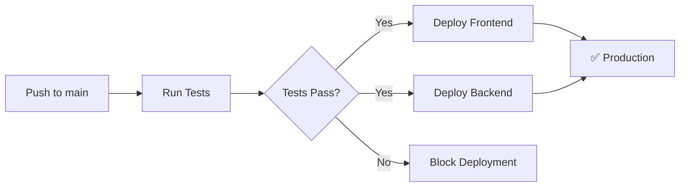

# 🚀 AURA Deployment Guide

Complete guide to deploy AURA to production using Vercel (frontend) and Railway (backend + PostgreSQL).

## 📋 Prerequisites

- GitHub account with this repository
- Vercel account (free tier)
- Railway account (with $5 credit/month)

---

## 🎯 Deployment Stack

| Component | Service | Cost | URL |
|-----------|---------|------|-----|
| Frontend | Vercel | **Free** | `your-app.vercel.app` |
| Backend API | Railway | **$5/month credit** | `your-app.up.railway.app` |
| PostgreSQL | Railway | **Included** | Internal Railway network |

---

## 1️⃣ Deploy Backend to Railway

### Step 1: Create Railway Account

1. Go to [railway.app](https://railway.app)
2. Sign up with GitHub
3. You'll get **$5 in credits per month**

### Step 2: Create New Project

1. Click **"New Project"**
2. Select **"Deploy from GitHub repo"**
3. Choose **`aura_test`** repository
4. Railway will detect your backend automatically

### Step 3: Add PostgreSQL Database

1. In your Railway project, click **"+ New"**
2. Select **"Database"** → **"PostgreSQL"**
3. Railway will automatically create and link the database

### Step 4: Configure Environment Variables

In Railway project settings, add these variables:

```env
# Server Configuration
PORT=3000
NODE_ENV=production

# Database (Railway auto-provides these, but verify)
DB_HOST=${{Postgres.PGHOST}}
DB_PORT=${{Postgres.PGPORT}}
DB_USERNAME=${{Postgres.PGUSER}}
DB_PASSWORD=${{Postgres.PGPASSWORD}}
DB_NAME=${{Postgres.PGDATABASE}}

# JWT Configuration (CHANGE THESE!)
JWT_SECRET=your_production_jwt_secret_min_32_characters_long_random_string
JWT_EXPIRES_IN=7d
```

**🔒 IMPORTANT:** Generate a strong JWT_SECRET:
```bash
node -e "console.log(require('crypto').randomBytes(32).toString('hex'))"
```

### Step 5: Configure Build Settings

Railway should auto-detect, but verify:

- **Build Command:** `cd backend && npm ci && npm run build`
- **Start Command:** `cd backend && npm start`
- **Root Directory:** `/` (project root)

### Step 6: Enable Health Checks

1. Go to **Settings** → **Health Check**
2. Set **Health Check Path:** `/health`
3. Set **Health Check Timeout:** `10 seconds`
4. Set **Health Check Interval:** `30 seconds`

### Step 7: Deploy

1. Click **"Deploy"**
2. Wait for build to complete (~2-3 minutes)
3. Your backend will be available at: `https://your-backend.up.railway.app`

### Step 8: Get Your Backend URL

1. Go to **Settings** → **Domains**
2. Copy the generated Railway domain
3. **Save this URL** - you'll need it for Vercel!

---

## 2️⃣ Deploy Frontend to Vercel

### Step 1: Create Vercel Account

1. Go to [vercel.com](https://vercel.com)
2. Sign up with GitHub (free tier)

### Step 2: Import Project

1. Click **"Add New..."** → **"Project"**
2. Import **`aura_test`** from GitHub
3. Vercel will auto-detect it's a Vite app

### Step 3: Configure Build Settings

**Framework Preset:** Vite

**Root Directory:** `frontend`

**Build Command:** `npm run build`

**Output Directory:** `dist`

**Install Command:** `npm install`

### Step 4: Configure Environment Variables

Add this environment variable:

| Name | Value |
|------|-------|
| `VITE_API_BASE_URL` | `https://your-backend.up.railway.app` |

**⚠️ Use your actual Railway backend URL from Step 1!**

### Step 5: Deploy

1. Click **"Deploy"**
2. Wait for build (~1-2 minutes)
3. Your frontend will be at: `https://your-app.vercel.app`

### Step 6: Configure Custom Domain (Optional)

1. Go to **Settings** → **Domains**
2. Add your custom domain
3. Configure DNS records as instructed

---

## 3️⃣ Configure GitHub Actions (Automatic Deployments)

### Step 1: Get Vercel Tokens

1. Go to [vercel.com/account/tokens](https://vercel.com/account/tokens)
2. Create a new token: **"GitHub Actions Deploy Token"**
3. **Copy the token** (you won't see it again!)

4. Install Vercel CLI locally:
   ```bash
   npm i -g vercel
   ```

5. Link your project:
   ```bash
   cd frontend
   vercel link
   ```

6. Get your Vercel credentials:
   ```bash
   cat .vercel/project.json
   ```
   
   Copy the `projectId` and `orgId`

### Step 2: Get Railway Token

1. Go to [railway.app/account/tokens](https://railway.app/account/tokens)
2. Create a new token: **"GitHub Actions Deploy"**
3. **Copy the token**

### Step 3: Add GitHub Secrets

Go to your GitHub repository → **Settings** → **Secrets and variables** → **Actions**

Add these secrets:

| Secret Name | Value | Where to get it |
|-------------|-------|----------------|
| `VERCEL_TOKEN` | `your_vercel_token` | Vercel account tokens |
| `VERCEL_ORG_ID` | `team_xxx` or `user_xxx` | `.vercel/project.json` |
| `VERCEL_PROJECT_ID` | `prj_xxx` | `.vercel/project.json` |
| `RAILWAY_TOKEN` | `your_railway_token` | Railway account tokens |

### Step 4: Test Automatic Deployment

1. Make a small change to your code
2. Commit and push to `main`:
   ```bash
   git add .
   git commit -m "test: trigger automatic deployment"
   git push origin main
   ```

3. Go to **Actions** tab in GitHub
4. Watch your deployment workflow run!

**Workflow will:**
- ✅ Run tests
- ✅ Deploy frontend to Vercel
- ✅ Deploy backend to Railway
- ✅ Report status

---

## 4️⃣ Update CORS in Backend

After deployment, update CORS to allow your Vercel frontend:

**Option 1: Using Railway Dashboard**

Add environment variable:
```env
CORS_ORIGIN=https://your-app.vercel.app
```

**Option 2: Update Code**

Edit `backend/src/index.ts`:

```typescript
app.use(cors({
  origin: process.env.CORS_ORIGIN || 'http://localhost:5173',
  credentials: true,
}));
```

Then redeploy.

---

## 5️⃣ Verify Deployment

### Test Backend

```bash
curl https://your-backend.up.railway.app/health
```

Expected response:
```json
{
  "status": "ok",
  "message": "AURA API is running",
  "timestamp": "2024-01-01T00:00:00.000Z"
}
```

### Test Frontend

1. Visit `https://your-app.vercel.app`
2. Register a new user
3. Login
4. View dashboard

### Test Full Integration

1. Register → Should create user in Railway PostgreSQL
2. Login → Should receive JWT token
3. Dashboard → Should load profile and users list

---

## 📊 Monitoring & Logs

### Railway

- **Logs:** Railway Dashboard → Your Service → **Logs** tab
- **Metrics:** CPU, Memory, Network usage
- **Database:** Query logs, connection pool stats

### Vercel

- **Deployment Logs:** Vercel Dashboard → Your Project → **Deployments**
- **Function Logs:** (if using serverless functions)
- **Analytics:** Free analytics on all deployments

---

## 🔄 CI/CD Workflow

Every push to `main` branch:



---

## 🐛 Troubleshooting

### Backend Issues

**Problem:** Backend not starting

**Solution:** Check Railway logs:
1. Railway Dashboard → Service → Logs
2. Look for errors in build or start command
3. Verify environment variables are set

**Problem:** Database connection failed

**Solution:**
1. Verify PostgreSQL service is running
2. Check if `synchronize: true` is disabled in production
3. Railway auto-provides database URLs, ensure they're referenced correctly

**Problem:** Health check failing

**Solution:**
1. Test health endpoint manually: `/health`
2. Increase health check timeout in Railway settings
3. Check if server is binding to `0.0.0.0` not just `localhost`

### Frontend Issues

**Problem:** API calls failing (CORS errors)

**Solution:**
1. Update `VITE_API_BASE_URL` in Vercel
2. Ensure Railway backend URL is correct
3. Configure CORS in backend to allow Vercel domain

**Problem:** Environment variable not working

**Solution:**
1. Vercel requires `VITE_` prefix for client-side variables
2. Redeploy after adding/changing variables
3. Check variable in Vercel Dashboard → Settings → Environment Variables

### GitHub Actions Issues

**Problem:** Deployment workflow failing

**Solution:**
1. Check **Actions** tab for error logs
2. Verify all GitHub secrets are set correctly
3. Ensure token permissions are correct

---

## 💰 Cost Breakdown

| Service | Free Tier | Estimated Cost |
|---------|-----------|----------------|
| Vercel | ✅ Unlimited | **$0/month** |
| Railway | $5 credit/month | **~$3-4/month** (with credit = ~$1-2 paid) |
| **Total** | | **~$1-2/month** |

**Notes:**
- Railway $5 credit renews monthly
- This project should stay under $5/month
- First month is effectively free

---

## 🎉 Success!

Your AURA app is now live:

- **Frontend:** `https://your-app.vercel.app`
- **Backend API:** `https://your-backend.up.railway.app`
- **Auto-Deploy:** Every push to `main`
- **Tests:** Run before every deployment

---

## 📚 Additional Resources

- [Vercel Documentation](https://vercel.com/docs)
- [Railway Documentation](https://docs.railway.app)
- [GitHub Actions Documentation](https://docs.github.com/en/actions)

---

## 🔐 Security Checklist

After deployment:

- [ ] Change `JWT_SECRET` to a strong random string
- [ ] Disable `synchronize: true` in TypeORM (use migrations)
- [ ] Configure CORS with specific frontend domain
- [ ] Enable HTTPS only (Vercel and Railway do this automatically)
- [ ] Set up environment-specific variables
- [ ] Review Railway database backups settings
- [ ] Set up error monitoring (optional: Sentry)
- [ ] Configure rate limiting (future improvement)

---

## 📝 Next Steps

1. **Custom Domain:** Add your own domain in Vercel
2. **Monitoring:** Set up Sentry or LogRocket
3. **Backups:** Configure Railway database backups
4. **Performance:** Enable caching, CDN optimization
5. **Security:** Add rate limiting, implement refresh tokens

---

**Need Help?**

- Railway Discord: [discord.gg/railway](https://discord.gg/railway)
- Vercel Support: [vercel.com/support](https://vercel.com/support)

